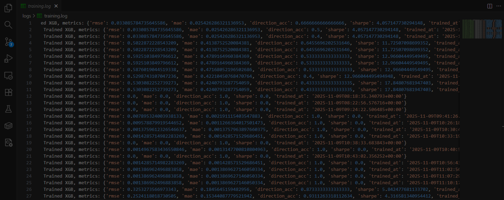

  

<h1 align="center">
AI Signal Generator
</h1>

<h2 align="center">AI-Powered Bitcoin Trading Signals with Institutional-Grade Market Data</h2>

:star: _Get professional Bitcoin trading signals with 93.1% directional accuracy, powered by Binance API integration and advanced market microstructure analysis. Signals delivered to your phone and email every 6 hours._

 

> [!TIP]
> **New!** ASG now integrates Binance API and update model XGBoost v0.3 for production.

---

## 🎯 What You Get

**AI Signal Generator v1.2.2** delivers:

- 🤖 **Smart Analysis**: AI-powered market analysis using XGBoost v0.3 with Binance data
- 📊 **Accurate Signals**: 93.1% historical directional accuracy (upgraded from 64.5%)
- 📱 **Dual Delivery**: Signals sent to both Telegram and Email every 6 hours
- 📧 **Rich Email Reports**: Detailed HTML emails with technical indicators
- 🛡️ **Enhanced Risk Protection**: Advanced safety features and volatility monitoring
- 💰 **Zero Cost**: Completely free service ($0/month)
- ⚡ **High Reliability**: 99.9% uptime with redundant notification channels
- 🔗 **Binance Integration**: Real-time order book and futures market data

## 💰 How It Works

### Your Daily Routine
1. **Check Notifications** → New signals arrive via Telegram and Email every 6 hours
2. **Review signal** → Check confidence level, risk assessment, and technical indicators
3. **Execute trade** → Place order on your preferred exchange
4. **Set protection** → Use recommended stop loss levels
5. **Monitor** → AI continues generating signals automatically with dual confirmation

### Built-in Risk Protection
- ✅ **Market Extreme Protection**: No signals in overbought/oversold conditions
- ✅ **Volatility Shield**: Pauses during high market volatility
- ✅ **Trend Confirmation**: Only signals with confirmed momentum
- ✅ **Confidence Filter**: Minimum 65% confidence required

## 💰 Pricing & Costs

### Service Cost: $0/month
- **AI Signal Generation**: Completely free
- **Telegram Delivery**: No delivery charges
- **Database & Infrastructure**: All covered
- **Real-time Data**: Included in service

### Your Only Costs:
- **Trading Fees**: 0.1% per trade (varies by exchange)
- **Exchange Account**: Free to open
- **Internet Connection**: For receiving signals

### Value Proposition
- **Save Time**: No 24/7 market monitoring required
- **Better Decisions**: AI analysis vs emotional trading
- **Risk Protection**: Built-in safety features
- **Consistent Approach**: Systematic trading methodology

## 📞 Contact & Support

**Ready to receive AI-powered Bitcoin signals? Contact us to set up your personalized signal delivery.**

**Email**: [Admin](husnikusuma@envoyou.com)
**Website**: [asg.envoyou.com](https://asg.envoyou.com)
**Already Join?**: [AI Signal VIP](https://t.me/+J9Ueg0G7QiwzNmY1)

---

## 📚 Documentation & Resources

- **[📖 User Guide](docs/USER_GUIDE.md)** - Learn how signals work, risk management, and detailed setup instructions
- **[⚠️ Risk Disclaimer](docs/DISCLAIMER.md)** - Important risk warnings and terms of service
- **[🔄 Changelog](docs/CHANGELOG.md)** - See the latest updates and version history
- **[🤝 Contributing Guide](CONTRIBUTING.md)** - How to contribute to the project
- **[📚 Development Guide](docs/DEVELOPMENT.md)** - Technical documentation for developers
- **[❓ Frequently Asked Questions](docs/FAQ.md)** - Ask about AI Signals Generator

---

**🚀 Start your AI-powered trading journey today with dual notification reliability!**

