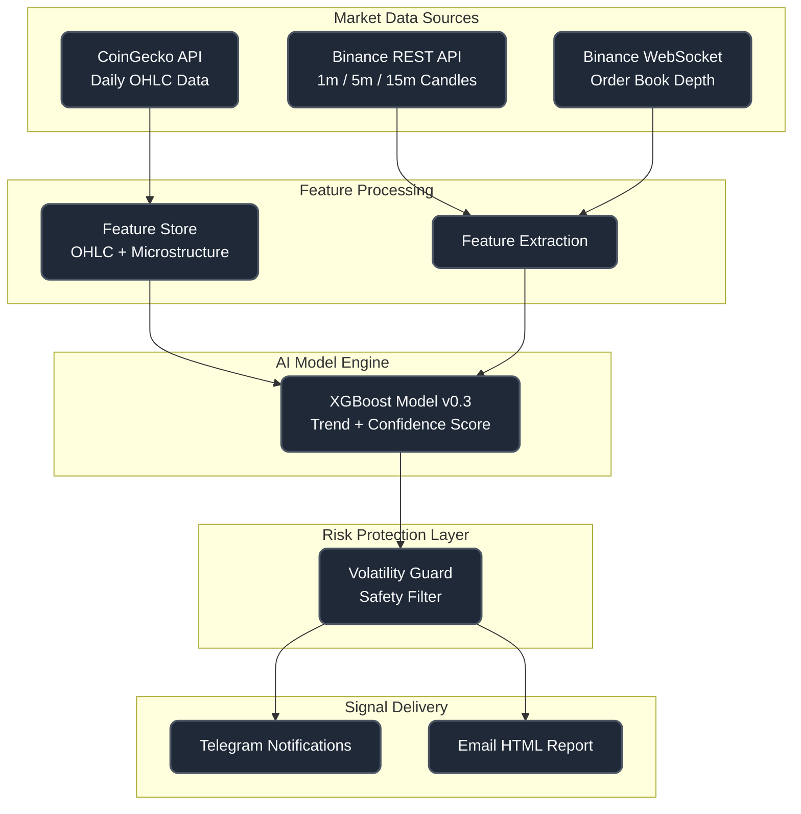

# Development Guide

This guide provides technical documentation for developers working on the AI Signal Generator frontend application.

## 🏗️ Architecture Overview

### Tech Stack
- **Frontend Framework**: React 19.1.1
- **Build Tool**: Vite 7.1.7
- **Styling**: Tailwind CSS 4.1.17
- **Language**: JavaScript (ES6+)
- **Linting**: ESLint 9.36.0

### Project Structure
```
website-asg/
├── public/                 # Static assets
│   ├── *.png              # Images and icons
│   └── *.svg              # Vector graphics
├── src/
│   ├── assets/            # Imported assets
│   ├── components/        # Reusable React components
│   │   ├── FAQ.jsx        # FAQ section component
│   │   ├── Features.jsx   # Features showcase
│   │   ├── Footer.jsx     # Site footer
│   │   ├── Header.jsx     # Site header/navigation
│   │   ├── Hero.jsx       # Hero section
│   │   ├── Logo.jsx       # Logo component
│   │   └── Pricing.jsx    # Pricing information
│   ├── pages/             # Page components (if any)
│   ├── App.jsx            # Main application component
│   ├── App.css            # Application styles
│   ├── index.css          # Global styles
│   └── main.jsx           # Application entry point
├── docs/                  # Documentation
├── package.json           # Dependencies and scripts
├── vite.config.js         # Vite configuration
├── eslint.config.js       # ESLint configuration
└── README.md              # Project overview
```
---

## 🔌 Backend Signal Pipeline (Reference Only)

> Data Sources: `CoinGecko`, `Binance REST API`, `Binance WebSocket`
>  
> ML Model Version: `XGBoost v0.3`  
>  
> Output Channels: `Telegram`, `Email`



## 🚀 Getting Started

### Prerequisites
- Node.js (version 16 or higher)
- npm or yarn package manager

### Installation
```bash
# Clone the repository
git clone <repository-url>
cd website-asg

# Install dependencies
npm install

# Start development server
npm run dev
```

### Available Scripts
- `npm run dev` - Start development server with hot reload
- `npm run build` - Build for production
- `npm run preview` - Preview production build locally
- `npm run lint` - Run ESLint for code quality checks

## 🧩 Component Structure

### Component Guidelines
- Use functional components with hooks
- Follow PascalCase naming convention
- Keep components focused on single responsibility
- Use descriptive prop names and provide default values
- Add PropTypes or TypeScript for type safety (future enhancement)

### Key Components

#### App.jsx
Main application component that orchestrates the entire frontend.

#### Header.jsx
Navigation component with responsive design and smooth scrolling.

#### Hero.jsx
Landing section with call-to-action and key messaging.

#### Features.jsx
Showcase of product features with icons and descriptions.

#### Pricing.jsx
Pricing information and subscription details.

#### FAQ.jsx
Frequently asked questions with expandable answers.

#### Footer.jsx
Site footer with links and contact information.

## 🎨 Styling Guidelines

### Tailwind CSS
- Use utility-first approach
- Follow mobile-first responsive design
- Use consistent spacing scale (4px increments)
- Leverage Tailwind's dark mode capabilities if needed

### CSS Custom Properties
Define design tokens in `index.css` for consistent theming:
```css
:root {
  --primary-color: #your-color;
  --secondary-color: #your-color;
  /* ... other design tokens */
}
```

## 🔧 Development Workflow

### Code Quality
- Run `npm run lint` before committing
- Fix all ESLint warnings and errors
- Follow React best practices
- Use meaningful commit messages

### Performance Optimization
- Optimize images and assets
- Use lazy loading for components when appropriate
- Minimize bundle size
- Implement code splitting if needed

### Browser Support
- Modern browsers (Chrome, Firefox, Safari, Edge)
- Mobile browsers (iOS Safari, Chrome Mobile)
- Progressive enhancement approach

## 📱 Responsive Design

### Breakpoints
- Mobile: < 768px
- Tablet: 768px - 1024px
- Desktop: > 1024px

### Mobile-First Approach
- Design for mobile first
- Use responsive utilities for larger screens
- Test on actual devices and browser dev tools

## 🔗 API Integration

### Backend Communication
The frontend communicates with the AI Signal Generator backend API for:
- User registration and authentication
- Signal delivery preferences
- Historical signal data (future feature)

### Environment Variables
Create `.env.local` for local development:
```env
VITE_API_BASE_URL=http://localhost:8000/api
VITE_TELEGRAM_BOT_TOKEN=your_token_here
```

## 🧪 Testing

### Testing Strategy
- Component testing with React Testing Library (future implementation)
- End-to-end testing with Playwright or Cypress (future implementation)
- Manual testing across different devices and browsers

### Test Coverage
- Aim for 80%+ code coverage
- Test critical user paths
- Test component props and state changes

## 🚀 Deployment

### Build Process
```bash
npm run build
```
This creates optimized production files in the `dist/` directory.

### Deployment Platforms
- Netlify (recommended for static sites)
- Vercel
- GitHub Pages
- Traditional web hosting

### Environment Configuration
- Use environment-specific variables
- Configure build settings for production
- Set up CDN for assets

## 🔍 Debugging

### Common Issues
- Clear browser cache when styles don't update
- Check console for JavaScript errors
- Verify API endpoints are accessible
- Test on different network conditions

### Development Tools
- React Developer Tools
- Browser DevTools
- Vite DevTools
- ESLint extension

## 📚 Resources

### Documentation Links
- [React Documentation](https://react.dev/)
- [Vite Guide](https://vitejs.dev/guide/)
- [Tailwind CSS Docs](https://tailwindcss.com/docs)
- [ESLint Rules](https://eslint.org/docs/rules/)

### Related Projects
- Backend API repository
- Mobile app repository (if applicable)
- Design system repository (if applicable)

## 🤝 Contributing

See [CONTRIBUTING.md](../CONTRIBUTING.md) for detailed contribution guidelines.

## 📞 Support

For development support:
- Check existing [issues](https://github.com/ENVOYou/website-asg/issues) on GitHub
- Join our Telegram channel: [AI Signal VIP](https://t.me/+J9Ueg0G7QiwzNmY1)
- Contact: [Admin](husnikusuma@envoyou.com)

---

**Happy coding!** 🎉